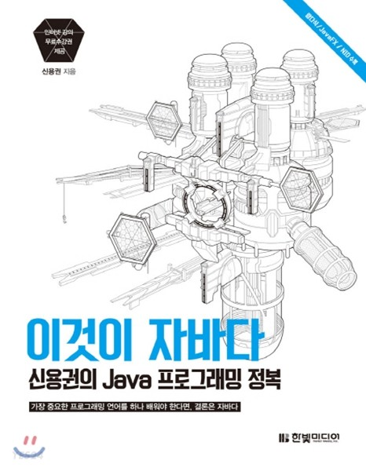

## 휴먼교육센터 - 빅데이터/웹개발과정 

---
- JAVA
  - 2022.08.05 ~ 2022.08.26
  - 교재 : [이것이 자바다 1, 2 (한빛 미디어)](https://github.com/benigndeus/ThisIsJava)
  -  

- FrontEnd
  - 2022.08.26 ~ 2022.09.05
  - 교재 : [웹 사이트 따라 만들기 (이지스 퍼블리싱)](https://github.com/white-jang/Doit_WebClone)
  -   

- SQL
  - 2022.09.05 ~ 2022.09.16
  - 교재 : [오라클sql과 pl/sql을 다루는 기술 (길벗)](https://github.com/gilbutITbook/006696)
  -  
  -  [오라클 DB 와 SQL Developer 설치하며 겪은 일](https://github.com/gdr1112/SQL)

- Python
  - 2022.09.19 ~ 2022.09.27
  - 교재 : [파이썬 머신러닝 판다스 데이터 분석 (정보문화사)](https://github.com/Castlegus/python-machine-learning-pandas-data-analysis)
  -  

- Spring
  - 2022.09.28 ~ 2022.10.14
  - 교재 : [예제로 배우는 스프링 부트 입문 (비제이퍼블릭)](https://bjpublic.tistory.com/384)
  - 

- Python Machine Learning
  - 2022.10.14 ~ 2022.10.21
  - 교재 : [머신러닝 데이터 전처리 입문 (로드북)](https://roadbook.co.kr/244)
  -  

- Python Deep Learning
  - 2022.10.21 ~ 2022.11.06
  - 교재 : [딥러닝 텐서플로 교과서 (길벗)](https://github.com/gilbutITbook/080263)
  -  

---

### 프로젝트

- 챗봇 프로젝트
  - 2022.11.11 ~ 2022.12.02
  - [프로젝트 폴더 링크](https://github.com/gdr1112/project.git)